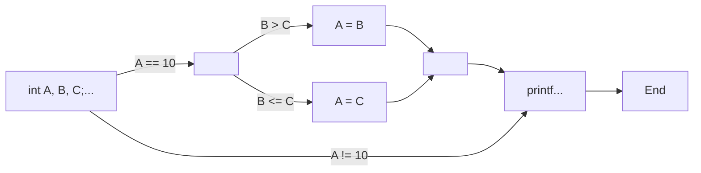
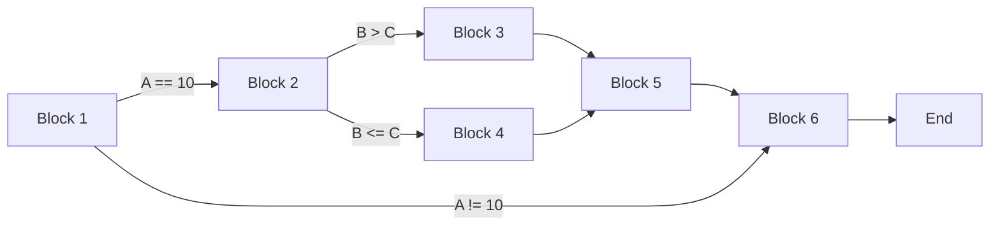
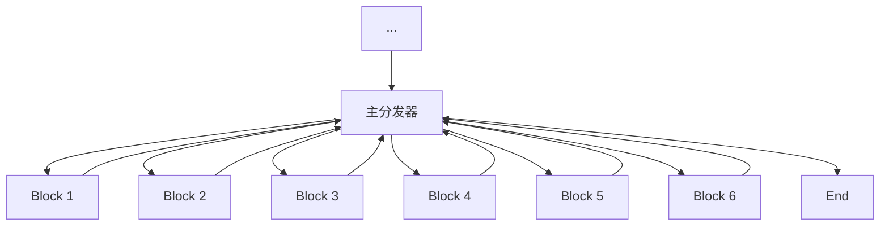

# Part 3: C语言-循环语句

Author: [Sikesibian](https://github.com/sikesibian)

* TOC
{:toc}

<font color=HotPink size=5>！注意：点击小箭头可以展开</font>

## 1. for循环语句

<details>
<summary>for循环描述</summary>
<br>
<div markdown="1">

for循环语句的格式如下：
```c
for(初始化语句 ; 循环条件 ; 循环步长){
    循环体
}
```
- **初始化语句**：在**循环开始前**执行，只执行一次
- **循环条件**：在**循环体开始前**执行
- **循环步长**：在**循环体结束后**执行
- **循环体**：循环主体代码。

</div>
</details>

### 练习1：阶乘（for循环的基本使用）

<details>
<summary>输入一个整数n，输出n!的结果。</summary>
<br>
<div markdown="1">

输入数据范围：`-100 <= n <= 100`

输入输出示例：
```
输入：
5
输出：
120
```
```
输入：
-6
输出：
Invalid Input
```

</div>
</details>

### 练习2：简单的素数判定（for循环嵌套条件语句）

<details>
<summary>输入一个正整数n，判断n是否为素数。</summary>
<br>
<div markdown="1">

输入数据范围：`1 <= n <= 100000`

输入输出示例：
```
输入：
13
输出：
Yes
```
```
输入：
15
输出：
No
```

**提示：**
1. 素数是正整数，并且除了1和自身以外，没有其他因数。
2. 1不是素数。
3. 2是素数。

</div>
</details>

### 练习3：输出一个数的所有因数（for循环嵌套条件语句）

<details>
<summary>输入一个正整数n，输出n的所有真因数。</summary>
<br>
<div markdown="1">

输入数据范围：`1 <= n <= 100000`

输入输出示例：
```
输入：
12
输出：
1, 2, 3, 4, 6, 12
```

**提示：**
1. 真因数不包括自身。

</div>
</details>

### 练习4：输出一个数的所有素因数（for循环嵌套for循环语句）

<details>
<summary>输入一个正整数n，输出n的所有素因数。</summary>
<br>
<div markdown="1">

输入数据范围：`1 <= n <= 100000`

输入输出示例：
```
输入：
12
输出：
2, 3
```

</div>
</details>


### 练习5：控制流平坦化（for循环嵌套switch语句）

<details>
<summary>控制流</summary>
<br>
<div markdown="1">

**控制流**往往指的是**计算机执行一个程序中语句的顺序**。程序会从第一行代码开始执行直至最后一行，除非**遇到（实际中是非常普遍地）改变控制流**的代码结构，比**如条件语句和循环**。控制流往往有三种结构：**顺序结构、循环结构和分支结构（可以理解为跳转）**。

> - **基本块**：函数控制流图中的最小基本块，**只有一个“入口”和一个“出口”，且只能从其“入口”进入，从“出口”退出**。**中间没有跳转**（如条件跳转，循环跳转，函数跳转或返回等）。值得一提的是：**只要基本块中第一条指令被执行了，那么基本块内所有执行都会按照顺序仅执行一次**。
> - **控制流图（Control Flow Graph, CFG）** ：是过程或程序的抽象表示，**代表了一个程序执行过程中会走过的所有路径**，它使用一个图的形式来**表示所有基本块可能从哪儿来，到哪儿去**。是之后会学习到的编译优化与静态分析的重要工具之一。

对于下述代码片段：   

```c
int A, B, C;
scanf("%d %d %d", &A, &B, &C);
if (A == 10) {
    if (B > C) {
        A = B;
    }
    else {
        A = C;
    }
}
printf("%d %d %d\n", A, B, C);
```

那么它的控制流图可以近似理解为：   

<section class="js-render-needs-enrichment render-needs-enrichment position-relative" data-identity="c9663031-b158-4375-bb81-9cdcc7a26c7b" data-host="https://viewscreen.githubusercontent.com" data-src="https://viewscreen.githubusercontent.com/markdown/mermaid?docs_host=https%3A%2F%2Fdocs.github.com" data-type="mermaid" aria-label="mermaid rendered output container">
  <div class="js-render-enrichment-target" data-json="{&quot;data&quot;:&quot;graph LR;\n    A[int A, B, C;...] --&amp;gt;|A == 10| B[ ]\n    B --&amp;gt;|B &amp;gt; C| C[A = B]\n    B --&amp;gt;|B &amp;lt;= C| D[A = C]\n    C --&amp;gt; E[ ]\n    D --&amp;gt; E\n    E --&amp;gt; F[printf...]\n    A --&amp;gt;|A != 10| F\n    F --&amp;gt; G[End]\n&quot;}" data-plain="graph LR;
    A[int A, B, C;...] -->|A == 10| B[ ]
    B -->|B > C| C[A = B]
    B -->|B <= C| D[A = C]
    C --> E[ ]
    D --> E
    E --> F[printf...]
    A -->|A != 10| F
    F --> G[End]
" dir="auto"><!----><!----><div class="position-absolute top-0 pr-2 right-0 d-flex flex-justify-end flex-items-center">
    
    <details class="details-reset details-overlay details-overlay-dark" style="display: contents">
      <summary role="button" aria-label="Open dialog" class="btn my-2 mr-2 p-0 d-inline-flex" aria-haspopup="dialog">
        <svg width="16" height="16" viewBox="0 0 16 16" fill="currentColor" class="octicon m-2">
          <path fill-rule="evenodd" d="M3.72 3.72a.75.75 0 011.06 1.06L2.56 7h10.88l-2.22-2.22a.75.75 0 011.06-1.06l3.5 3.5a.75.75 0 010 1.06l-3.5 3.5a.75.75 0 11-1.06-1.06l2.22-2.22H2.56l2.22 2.22a.75.75 0 11-1.06 1.06l-3.5-3.5a.75.75 0 010-1.06l3.5-3.5z"></path>
        </svg>
      </summary>
      <details-dialog class="Box Box--overlay render-full-screen d-flex flex-column anim-fade-in fast" aria-label="mermaid rendered container" role="dialog" aria-modal="true">
        <div>
          <button aria-label="Close dialog" data-close-dialog="" type="button" data-view-component="true" class="Link--muted btn-link position-absolute render-full-screen-close">
            <svg width="24" height="24" viewBox="0 0 24 24" fill="currentColor" style="display:inline-block;vertical-align:text-bottom" class="octicon octicon-x">
              <path fill-rule="evenodd" d="M5.72 5.72a.75.75 0 011.06 0L12 10.94l5.22-5.22a.75.75 0 111.06 1.06L13.06 12l5.22 5.22a.75.75 0 11-1.06 1.06L12 13.06l-5.22 5.22a.75.75 0 01-1.06-1.06L10.94 12 5.72 6.78a.75.75 0 010-1.06z"></path>
            </svg>
          </button>
          <div class="Box-body border-0" role="presentation"></div>
        </div>
      </details-dialog>
    </details>
  <!----><clipboard-copy class="btn my-2 js-clipboard-copy p-0 d-inline-flex tooltipped-no-delay" role="button" data-copy-feedback="Copied!" data-tooltip-direction="s" aria-label="Copy mermaid code" value="graph LR;
    A[int A, B, C;...] -->|A == 10| B[ ]
    B -->|B > C| C[A = B]
    B -->|B <= C| D[A = C]
    C --> E[ ]
    D --> E
    E --> F[printf...]
    A -->|A != 10| F
    F --> G[End]
" tabindex="0">
    <svg aria-hidden="true" height="16" viewBox="0 0 16 16" version="1.1" width="16" class="octicon octicon-copy js-clipboard-copy-icon m-2">
      <path fill-rule="evenodd" d="M0 6.75C0 5.784.784 5 1.75 5h1.5a.75.75 0 010 1.5h-1.5a.25.25 0 00-.25.25v7.5c0 .138.112.25.25.25h7.5a.25.25 0 00.25-.25v-1.5a.75.75 0 011.5 0v1.5A1.75 1.75 0 019.25 16h-7.5A1.75 1.75 0 010 14.25v-7.5z"></path>
      <path fill-rule="evenodd" d="M5 1.75C5 .784 5.784 0 6.75 0h7.5C15.216 0 16 .784 16 1.75v7.5A1.75 1.75 0 0114.25 11h-7.5A1.75 1.75 0 015 9.25v-7.5zm1.75-.25a.25.25 0 00-.25.25v7.5c0 .138.112.25.25.25h7.5a.25.25 0 00.25-.25v-7.5a.25.25 0 00-.25-.25h-7.5z"></path>
    </svg>
    <svg aria-hidden="true" height="16" viewBox="0 0 16 16" version="1.1" width="16" class="octicon octicon-check js-clipboard-check-icon color-fg-success d-none m-2">
      <path fill-rule="evenodd" d="M13.78 4.22a.75.75 0 010 1.06l-7.25 7.25a.75.75 0 01-1.06 0L2.22 9.28a.75.75 0 011.06-1.06L6 10.94l6.72-6.72a.75.75 0 011.06 0z"></path>
    </svg>
  </clipboard-copy>
  </div><!---->
    <div class="render-container color-bg-transparent js-render-target p-0 is-render-automatic is-render-requested is-render-ready" data-identity="c9663031-b158-4375-bb81-9cdcc7a26c7b" data-host="https://viewscreen.githubusercontent.com" data-type="mermaid" style="height: 310.521px;">
      <iframe title="File display" role="presentation" class="render-viewer" sandbox="allow-scripts allow-same-origin allow-top-navigation allow-popups" src="https://viewscreen.githubusercontent.com/markdown/mermaid?docs_host=https%3A%2F%2Fdocs.github.com&amp;color_mode=light#c9663031-b158-4375-bb81-9cdcc7a26c7b" name="c9663031-b158-4375-bb81-9cdcc7a26c7b" data-content="{&quot;data&quot;:&quot;graph LR;\n    A[int A, B, C;...] --&amp;gt;|A == 10| B[ ]\n    B --&amp;gt;|B &amp;gt; C| C[A = B]\n    B --&amp;gt;|B &amp;lt;= C| D[A = C]\n    C --&amp;gt; E[ ]\n    D --&amp;gt; E\n    E --&amp;gt; F[printf...]\n    A --&amp;gt;|A != 10| F\n    F --&amp;gt; G[End]\n&quot;}">
      </iframe>
    </div>
  <!----><!----></div>
  <span class="js-render-enrichment-loader d-flex flex-justify-center flex-items-center width-full" style="min-height:100px" role="presentation" hidden="">
    <span data-view-component="true">
  <svg style="box-sizing: content-box; color: var(--color-icon-primary);" width="16" height="16" viewBox="0 0 16 16" fill="none" aria-hidden="true" data-view-component="true" class="octospinner mx-auto anim-rotate">
    <circle cx="8" cy="8" r="7" stroke="currentColor" stroke-opacity="0.25" stroke-width="2" vector-effect="non-scaling-stroke" fill="none"></circle>
    <path d="M15 8a7.002 7.002 0 00-7-7" stroke="currentColor" stroke-width="2" stroke-linecap="round" vector-effect="non-scaling-stroke"></path>
</svg>    <span class="sr-only">Loading</span>
</span>
  </span>
<div class="js-render-enrichment-fallback"><div class="render-plaintext-hidden" dir="auto">
      <pre lang="mermaid" aria-label="Raw mermaid code">graph LR;
    A[int A, B, C;...] --&gt;|A == 10| B[ ]
    B --&gt;|B &gt; C| C[A = B]
    B --&gt;|B &lt;= C| D[A = C]
    C --&gt; E[ ]
    D --&gt; E
    E --&gt; F[printf...]
    A --&gt;|A != 10| F
    F --&gt; G[End]
</pre>
    </div></div></section>

    


</div>
</details>

<details>
<summary>练习：理解循环语句的控制流</summary>
<br>
<div markdown="1">

仿照上述示例，绘制下述代码中指定片段的控制流图：  

```c
# include <stdio.h>
int main() {
    int i, j, line = 0;
    int n;
    scanf("%d", &n);
    // the beginning of the code snippet
    for (i = 0, j = 1; j <= n; i ++, j ++) {
        printf("*");
        if (i == line) {printf("\n"); i = -1; line ++;}
    }
    if (i != 0) {printf("\n");}
    // the end of the code snippet
    return 0;
}
```

</div>
</details>


<details>
<summary>控制流平坦化</summary>
<br>
<div markdown="1">

**控制流平坦化（control flow flattening）** 实际上是一种作用于**控制流图**的**代码混淆**技术，其基本思想是**重新组织函数控制流图中基本块的关系**。细节内容可参考文献：[*Obfuscating C++ Programs via Control Flow Flattening*](<obfuscating c++ programs via control flow flattening.pdf>)  

> **代码混淆（Obfuscated Code）**：代码混淆是一种保护程序代码，如源代码（版权，漏洞分析难度等），的安全技术，**其将计算机程序的代码转换为一种功能上等价，但是阅读和理解更难的形式**。  

**控制流平坦化通过插入一个“主发生器”来负责控制程序的执行流，它将基本块间的前后关系进行混淆**，从而加大敌手拿到代码后的阅读分析的难度。   

比如上述给出的控制流图：  


对它们进行编号：




其平坦化后即可以写为为：  


具体的代码可以写为：  
```c
# include <stdio.h>

int main(){
    int state = 1;
    for (;state != -1;){
        switch (state){
            case 1:
                int A, B, C;
                scanf("%d %d %d", &A, &B, &C);
                if (A == 10) state = 2;       
                else state = 6;
                break;
            case 2:
                if (B > C) state = 3;
                else state = 4;
                break;
            case 3:
                A = B;
                state = 5;
                break;
            case 4:
                A = C;
                state = 5;
                break;
            case 5:
                state = 6;
                break;
            case 6:
                printf("%d %d %d\n", A, B, C);
                state = -1;
                break;
            }
        }
    return 0;
}
```

**思考下面的问题**：
1. **`state`变量**在代码中起到了什么作用？
2. 每一个 **`case i`块中的内容**，抽象地说，一般我们认为由**两部分**组成，分别是哪两部分？
3. 每一个 **`case i`块中的内容**与最开始我们给出的**控制流图、刚刚对基本块编过号的控制流图**有什么关系？
4. 你能简单**总结出我们将一个简单代码进行控制流平坦化的方法步骤**是什么吗？
5. 请尝试将刚刚请大家绘制控制流图的练习代码进行平坦化，给出你的代码，请自己验证修改后代码的正确性。

</div>
</details>

